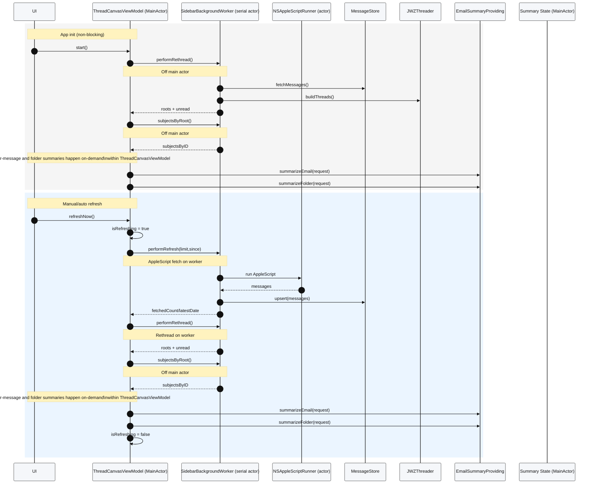

# BetterMail

BetterMail is a macOS SwiftUI companion for Apple Mail that pulls your inbox over Apple Events, stores a lightweight cache in Core Data, threads conversations with the JWZ algorithm, and can summarize what matters using Apple Intelligence when it is available on the device. The repository also ships a MailKit helper extension with sample content blocking, compose, and message action hooks that can evolve into automation shortcuts.

## Highlights
- Native SwiftUI thread canvas backed by `ThreadCanvasViewModel`, live unread counts, manual grouping/ungrouping, manual limits, and background auto-refresh.
- Thread canvas readability modes keep compact zoom nodes title-only to reduce visual noise.
- Account-aware mailbox sidebar with nested Apple Mail folders while keeping `All Inboxes` as the default landing scope.
- Folder headers support pin/unpin actions to keep important folders at the top of the list with a pin indicator.
- Folder details inspector includes a non-scrollable minimap with selected-node highlight, folder-scoped viewport overlay, and date ticks/labels while preserving relative spacing for click-to-jump navigation.
- Thread canvas view toggle switches between Default and Timeline modes; Timeline renders a vertical list of message entries with timestamps, sender/summary lines, and AI-generated tag chips.
- Appearance preferences support System, Light, and Dark modes from BetterMail Settings while keeping the glassmorphism styling consistent.
- AppleScript ingestion via `MailAppleScriptClient`/`NSAppleScriptRunner` plus `MailControl` helpers for move/create mailbox-folder, flag, and search actions against Apple Mail.
- Inspector "Open in Mail" uses AppleScript targeting (Message-ID plus filtered fallback search) without `message://` URLs.
- Persistent Core Data cache (`MessageStore`) so the UI can render instantly while refresh jobs run off the main actor.
- JWZ-style threading (`JWZThreader`) that annotates unread/message counts per thread and keeps a `MessageEntity` ↔ `ThreadEntity` mapping.
- Optional Apple Intelligence digests powered by `FoundationModelsEmailSummaryProvider` (Foundation Models on macOS 15.2+) that surface summaries in the inspector for the selected thread.
- MailKit helper target (`MailHelperExtension`) that demonstrates content blocking, compose session customization, message automation, and security handlers.

## Requirements
- macOS Sonoma (14) or newer with the built-in Apple Mail app configured. Apple Intelligence summaries additionally require macOS 15.2+, a compatible Apple Silicon Mac, and Apple Intelligence to be enabled in System Settings.
- Xcode 16 (or the latest stable Xcode) with the `BetterMail` and `MailHelperExtension` schemes.
- Access to Developer Team IDs/certificates so you can sign the sandboxed app and Mail extension.

## Repository Layout
- `BetterMail/BetterMail`: macOS app target (SwiftUI, Core Data, AppleScript and Apple Intelligence plumbing).
- `MailHelperExtension`: MailKit extension sources (`MailExtension`, handlers, and nibs).
- `Config`: Signing overlays (`*.xcconfig.example` templates for app + extension).
- `Tests`: XCTest targets (currently focused on threading; add more as logic evolves).

## Setup & Build
1. Copy the signing templates and fill in your identifiers:
   ```bash
   cp Config/AppSigning.xcconfig.example Config/AppSigning.xcconfig
   cp Config/ExtensionSigning.xcconfig.example Config/ExtensionSigning.xcconfig
   ```
   Update `DEVELOPMENT_TEAM_ID`, `BETTERMAIL_BUNDLE_ID`, and `MAIL_EXTENSION_BUNDLE_ID` to match your certificates.
2. Open `BetterMail.xcodeproj` in Xcode, pick the `BetterMail` scheme, and ensure the matching signing configs are selected in the target settings.
3. Build & run (`⌘R`) to launch the SwiftUI app. Use the `MailHelperExtension` scheme if you need to debug the MailKit target.
4. On first launch, macOS will prompt for Apple Mail automation access; allow it or the AppleScript fetcher/controls will fail.

### Command-Line Build
```bash
xcodebuild \
  -project BetterMail.xcodeproj \
  -scheme BetterMail \
  -configuration Debug \
  -destination 'platform=macOS' build
```

## Permissions & Privacy
- **Automation (Apple Events):** The app uses `com.apple.security.automation.apple-events` entitlements (see `BetterMail.entitlements`) to talk to `com.apple.mail`. macOS prompts the first time; you can review/change it under *System Settings → Privacy & Security → Automation*.
- **Mail Extension:** Enable *BetterMail Helper* inside Apple Mail > Settings > Extensions to activate the MailKit handlers. Without this step, the helper target stays inert.
- **Data Storage:** Cached messages are stored in `~/Library/Application Support/BetterMail/Messages.sqlite`. Delete that file if you need a clean slate.

## Architecture at a Glance
```
Mail.app ⇄ NSAppleScriptRunner → MailAppleScriptClient → MessageStore (Core Data)
                                            ↘︎ JWZThreader → ThreadCanvasViewModel → SwiftUI ThreadListView/ThreadCanvasView/ThreadInspectorView
                                                                             ↘︎ FoundationModelsEmailSummaryProvider (Apple Intelligence)
```
- `NSAppleScriptRunner` makes sure Mail is running, executes scripts, and logs failures.
- `MailAppleScriptClient` fetches message metadata + raw source, decodes headers/snippets, and hands `EmailMessage` models to the store.
- `MessageStore` keeps everything off the main actor, exposes async fetch/upsert helpers, and maintains per-thread entities.
- `JWZThreader` normalizes message IDs, builds parent/child containers, and annotates unread counts for the UI plus the store.
- `ThreadCanvasViewModel` orchestrates refreshes, auto-refresh timers, summary tasks, and selection state for the SwiftUI hierarchy.
- `EmailSummaryProviderFactory` lazily instantiates a Foundation Models `SystemLanguageModel` session when the platform supports Apple Intelligence to generate short digests of recent subjects.
- `MailControl` provides AppleScript helpers for message targeting, move/create mailbox-folder actions, flagging, and search workflows.

## Technical Notes

### Liquid Glass Nav Bar Readability
To keep the Liquid Glass look without losing nav bar legibility, the glass container is scoped to the list only and the nav bar is layered above it:
- `GlassEffectContainer` wraps just `canvasContent`, while `navigationBarOverlay` sits outside in a ZStack.
- Nav foreground colors are appearance-aware for glass mode, with a subtle text shadow to lift labels off the glass.
- The limit `TextField` swaps to a plain style with a translucent fill and stronger border so the input stays visible.
- The nav and inspector glass tints/strokes adapt per appearance (System/Light/Dark) to keep contrast and depth cues stable.

### Refresh & Summary Concurrency (Non-Blocking)
- Heavy work stays off `@MainActor`: AppleScript fetch, Core Data upserts, JWZ threading, subject gathering, and Apple Intelligence summaries all run on a dedicated serial actor (`SidebarBackgroundWorker`), with AppleScript executed by `NSAppleScriptRunner`.
- The main actor only applies UI state (`roots`, unread totals, summary text/status, `isRefreshing`), so the SwiftUI sidebar remains responsive during refreshes and summaries.
- Sequence diagram (source at `openspec/changes/refactor-refresh-concurrency/refresh-flow.mmd`):



### Infinite Canvas Paging
- The thread canvas expands in 7-day blocks when you scroll near the bottom of the current range.
- Scroll detection for paging is driven by `GeometryReader` content-frame updates so two-axis scrolling (horizontal + vertical) still triggers expansion.
- Scroll offsets are quantized before updating visible-range state, and paging expansion now uses a short near-bottom hysteresis/cooldown to avoid thrashing while scrubbing in and out near the threshold.
- Timeline layout cache keys use coarse zoom buckets so pinch gestures reuse layout work instead of rebuilding on tiny zoom deltas.
- Folder headers include icon-only jump actions (with hover tooltips) to move directly to the latest or first email node in that folder.
- Jump targets are resolved from DataStore-backed folder thread membership, and day-window expansion is applied in bounded increments to avoid large one-shot layout stalls.

### Canvas Virtualization Window
- The virtualized render window is computed in content coordinates using the raw scroll offset, so pinned folder headers/top padding do not shift which days and nodes are considered visible.

### Manual Grouping & Ungrouping
**User-facing**
- Multi-select two or more nodes to enable the Group action in the bottom selection bar.
- Select any node that is already part of a manual group (including grouped JWZ threads or manual attachments) to enable Ungroup.
- Ungroup removes the selected node(s) from the manual group without altering the underlying JWZ thread relationships.

**Technical**
- Manual grouping is stored in `ManualThreadGroup` records with two sets: `jwzThreadIDs` (grouped JWZ threads) and `manualMessageKeys` (manual attachments).
- `JWZThreader.applyManualGroups` overlays these manual groups onto the JWZ thread map so the UI renders combined groups.
- Ungrouping updates the owning `ManualThreadGroup` by removing selected `jwzThreadIDs` or `manualMessageKeys`; empty groups are deleted from `MessageStore`.

### JWZ Threading Algorithm
BetterMail’s threading model follows Jamie Zawinski’s canonical algorithm that many email clients rely on:
- Every message is normalized to a lowercase message-id (stripping angle brackets) so Mail’s inconsistent headers still point to the same canonical ID.
- JWZ `Container` nodes are built for each message and for any ids mentioned in `References`/`In-Reply-To` headers, so gaps in the chain do not break the tree.
- Parentage is reconstructed by walking the references from oldest → newest, adopting children as necessary, and collapsing empty containers once the real message arrives.
- Roots are flattened into `ThreadNode` structs sorted by last activity date and annotated with unread/count metadata so the UI and Core Data can stay in sync.
- Missing headers fall back to synthetic UUIDs, which means every message shows up in a deterministic thread even when Mail.app emits truncated metadata.
See `Sources/Threading/JWZThreader.swift` for the full implementation, including normalization helpers and the map that keeps `MessageEntity` rows linked to their thread IDs.

### Apple Intelligence Summaries
- When compiled on macOS 15.2 or later with the Foundation Models framework present, the app automatically instantiates `FoundationModelsEmailSummaryProvider`.
- Summaries are optional; if the model is unavailable, the UI falls back to status strings explaining what is required.
- The per-message and folder summaries are wired into the UI. The inbox subject-line digest (`summarize(subjects:)`) is implemented but not currently shown in the UI.
- The inbox subject-line digest API is deprecated.

## TechDocs
- See `TechDocs/index.md` for architecture, module map, data flow/concurrency notes, MailKit helper summary, and migration log.

## UI Layers (Current)
- App entry point: `BetterMail/BetterMailApp.swift` shows `ContentView` in the main `WindowGroup`.
- `BetterMail/ContentView.swift` renders a split layout with:
  - `MailboxSidebarView` on the left for account + mailbox-folder navigation.
  - `ThreadListView` on the right for the thread canvas, inspector, and action bars.
- `BetterMail/Sources/UI/ThreadListView.swift` composes the main canvas stack:
  - `ThreadCanvasView` as the full-window canvas.
  - `ThreadInspectorView` as a right-side overlay panel.
  - `navigationBarOverlay` as the top bar above the canvas.
  - `selectionActionBar` as a bottom overlay for multi-select actions.
- Mailbox-folder actions in the selection bar target Apple Mail folders (existing or newly created), while `Add to Thread Folder` keeps using BetterMail's internal canvas grouping feature.
- Opening the mailbox-folder move sheet now triggers a hierarchy refresh when account/folder destinations are missing, and hierarchy reads automatically retry AppleEvent timeout failures before surfacing an error.

## Testing
- Run all tests from Xcode (`⌘U`) or via CLI:
  ```bash
  xcodebuild test \
    -project BetterMail.xcodeproj \
    -scheme BetterMail \
    -destination 'platform=macOS'
  ```
- Most existing coverage exercises the threading logic. When you add non-UI business rules (store transformations, summary helpers, etc.), prefer adding focused XCTest cases under `Tests/`.

## Troubleshooting
- **AppleScript failures:** Double-check Mail is installed, unlocked, and Automation permission is granted. The `Log.applescript` logger streams details in Console.app under the `BetterMail` subsystem.
- **No summaries showing:** Ensure you're on macOS 15.2+, Apple Intelligence is enabled system-wide, and the device meets Apple's hardware requirements. The status text attached to each summary card shows the last availability check.
- **Mail extension missing:** Open Apple Mail → Settings → Extensions and enable the BetterMail helper; Mail must be restarted the first time to load the extension bundle.

BetterMail is intentionally modular—extend the SwiftUI surface area, add new store-backed services, or flesh out the MailKit extension without having to rewrite the ingestion/core threading pipeline.
