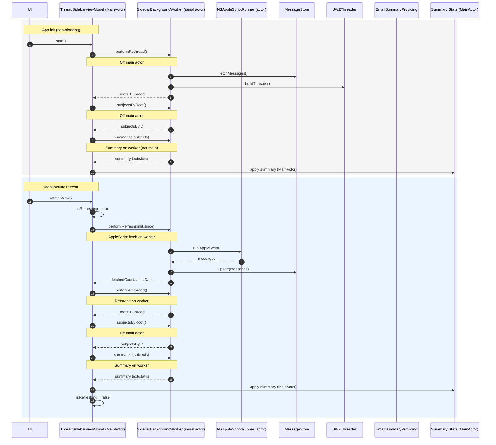

# BetterMail

BetterMail is a macOS SwiftUI companion for Apple Mail that pulls your inbox over Apple Events, stores a lightweight cache in Core Data, threads conversations with the JWZ algorithm, and can summarize what matters using Apple Intelligence when it is available on the device. The repository also ships a MailKit helper extension with sample content blocking, compose, and message action hooks that can evolve into automation shortcuts.

## Highlights
- Native SwiftUI thread sidebar backed by `ThreadSidebarViewModel`, live unread counts, manual limits, and background auto-refresh.
- AppleScript ingestion via `MailAppleScriptClient`/`AppleScriptRunner` plus `MailControl` helpers for move/flag/search actions against Apple Mail.
- Persistent Core Data cache (`MessageStore`) so the UI can render instantly while refresh jobs run off the main actor.
- JWZ-style threading (`JWZThreader`) that annotates unread/message counts per thread and keeps a `MessageEntity` ↔ `ThreadEntity` mapping.
- Optional Apple Intelligence digests powered by `EmailSummaryProvider` (Foundation Models on macOS 15.2+) that surface summaries inline with each thread.
- MailKit helper target (`MailHelperExtension`) that demonstrates content blocking, compose session customization, message automation, and security handlers.

## Requirements
- macOS Sonoma (14) or newer with the built-in Apple Mail app configured. Apple Intelligence summaries additionally require macOS 15.2+, a compatible Apple Silicon Mac, and Apple Intelligence to be enabled in System Settings.
- Xcode 16 (or the latest stable Xcode) with the `BetterMail` and `MailHelperExtension` schemes.
- Access to Developer Team IDs/certificates so you can sign the sandboxed app and Mail extension.

## Repository Layout
- `BetterMail/BetterMail`: macOS app target (SwiftUI, Core Data, AppleScript and Apple Intelligence plumbing).
- `MailHelperExtension`: MailKit extension sources (`MailExtension`, handlers, and nibs).
- `Config`: Signing overlays (`*.xcconfig.example` templates for app + extension).
- `Tests`: XCTest targets (currently focused on threading; add more as logic evolves).

## Setup & Build
1. Copy the signing templates and fill in your identifiers:
   ```bash
   cp Config/AppSigning.xcconfig.example Config/AppSigning.xcconfig
   cp Config/ExtensionSigning.xcconfig.example Config/ExtensionSigning.xcconfig
   ```
   Update `DEVELOPMENT_TEAM_ID`, `BETTERMAIL_BUNDLE_ID`, and `MAIL_EXTENSION_BUNDLE_ID` to match your certificates.
2. Open `BetterMail.xcodeproj` in Xcode, pick the `BetterMail` scheme, and ensure the matching signing configs are selected in the target settings.
3. Build & run (`⌘R`) to launch the SwiftUI app. Use the `MailHelperExtension` scheme if you need to debug the MailKit target.
4. On first launch, macOS will prompt for Apple Mail automation access; allow it or the AppleScript fetcher/controls will fail.

### Command-Line Build
```bash
xcodebuild \
  -project BetterMail.xcodeproj \
  -scheme BetterMail \
  -configuration Debug \
  -destination 'platform=macOS' build
```

## Permissions & Privacy
- **Automation (Apple Events):** The app uses `com.apple.security.automation.apple-events` entitlements (see `BetterMail.entitlements`) to talk to `com.apple.mail`. macOS prompts the first time; you can review/change it under *System Settings → Privacy & Security → Automation*.
- **Mail Extension:** Enable *BetterMail Helper* inside Apple Mail > Settings > Extensions to activate the MailKit handlers. Without this step, the helper target stays inert.
- **Data Storage:** Cached messages are stored in `~/Library/Application Support/BetterMail/Messages.sqlite`. Delete that file if you need a clean slate.

## Architecture at a Glance
```
Mail.app ⇄ AppleScriptRunner → MailAppleScriptClient → MessageStore (Core Data)
                                         ↘︎ JWZThreader → ThreadSidebarViewModel → SwiftUI ThreadListView/MessageRowView
                                                                          ↘︎ EmailSummaryProvider (Apple Intelligence)
```
- `AppleScriptRunner` makes sure Mail is running, executes scripts, and logs failures.
- `MailAppleScriptClient` fetches message metadata + raw source, decodes headers/snippets, and hands `EmailMessage` models to the store.
- `MessageStore` keeps everything off the main actor, exposes async fetch/upsert helpers, and maintains per-thread entities.
- `JWZThreader` normalizes message IDs, builds parent/child containers, and annotates unread counts for the UI plus the store.
- `ThreadSidebarViewModel` orchestrates refreshes, auto-refresh timers, summary tasks, and selection state for the SwiftUI hierarchy.
- `EmailSummaryProvider` lazily instantiates a Foundation Models `SystemLanguageModel` session when the platform supports Apple Intelligence to generate short digests of recent subjects.
- `MailControl` demonstrates how to execute follow-up AppleScript commands (move, flag, search) against the current Mail selection.

## Refresh & Summary Concurrency (Non-Blocking)
- Heavy work stays off `@MainActor`: AppleScript fetch, Core Data upserts, JWZ threading, subject gathering, and Apple Intelligence summaries all run on a dedicated serial actor (`SidebarBackgroundWorker`), with AppleScript executed by `NSAppleScriptRunner`.
- The main actor only applies UI state (`roots`, unread totals, summary text/status, `isRefreshing`), so the SwiftUI sidebar remains responsive during refreshes and summaries.
- Sequence diagram (source at `openspec/changes/refactor-refresh-concurrency/refresh-flow.mmd`):



### JWZ Threading Algorithm
BetterMail’s threading model follows Jamie Zawinski’s canonical algorithm that many email clients rely on:
- Every message is normalized to a lowercase message-id (stripping angle brackets) so Mail’s inconsistent headers still point to the same canonical ID.
- JWZ `Container` nodes are built for each message and for any ids mentioned in `References`/`In-Reply-To` headers, so gaps in the chain do not break the tree.
- Parentage is reconstructed by walking the references from oldest → newest, adopting children as necessary, and collapsing empty containers once the real message arrives.
- Roots are flattened into `ThreadNode` structs sorted by last activity date and annotated with unread/count metadata so the UI and Core Data can stay in sync.
- Missing headers fall back to synthetic UUIDs, which means every message shows up in a deterministic thread even when Mail.app emits truncated metadata.
See `Sources/Threading/JWZThreader.swift` for the full implementation, including normalization helpers and the map that keeps `MessageEntity` rows linked to their thread IDs.

## Apple Intelligence Summaries
- When compiled on macOS 15.2 or later with the Foundation Models framework present, the app automatically instantiates `FoundationModelsEmailSummaryProvider`.
- Summaries are optional; if the model is unavailable, the UI falls back to status strings explaining what is required.
- Keep subjects tidy—the summarizer currently limits itself to the 25 unique subject lines per thread to stay within token budgets.

## Testing
- Run all tests from Xcode (`⌘U`) or via CLI:
  ```bash
  xcodebuild test \
    -project BetterMail.xcodeproj \
    -scheme BetterMail \
    -destination 'platform=macOS'
  ```
- Most existing coverage exercises the threading logic. When you add non-UI business rules (store transformations, summary helpers, etc.), prefer adding focused XCTest cases under `Tests/`.

## Troubleshooting
- **AppleScript failures:** Double-check Mail is installed, unlocked, and Automation permission is granted. The `Log.applescript` logger streams details in Console.app under the `BetterMail` subsystem.
- **No summaries showing:** Ensure you're on macOS 15.2+, Apple Intelligence is enabled system-wide, and the device meets Apple's hardware requirements. The status text attached to each summary card shows the last availability check.
- **Mail extension missing:** Open Apple Mail → Settings → Extensions and enable the BetterMail helper; Mail must be restarted the first time to load the extension bundle.

BetterMail is intentionally modular—extend the SwiftUI surface area, add new store-backed services, or flesh out the MailKit extension without having to rewrite the ingestion/core threading pipeline.
