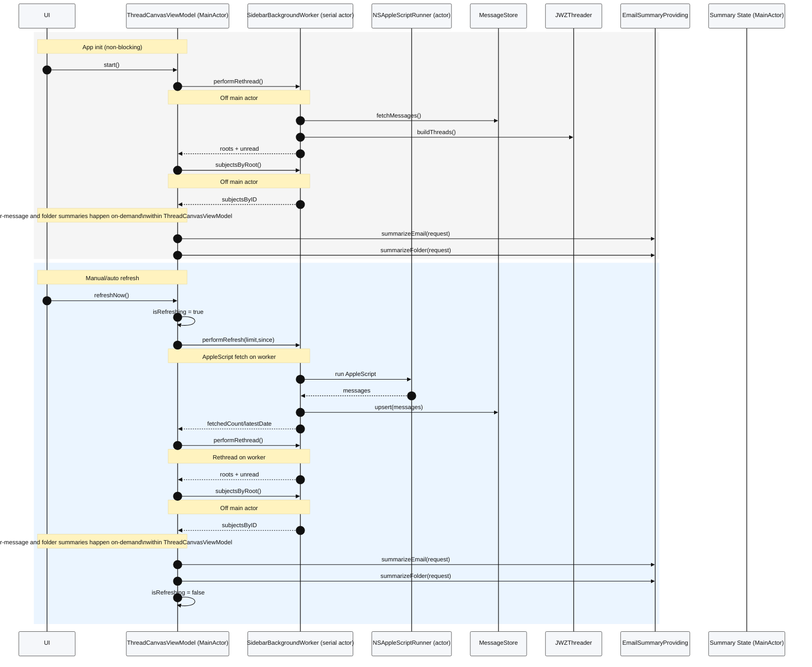

# BetterMail

BetterMail is a macOS SwiftUI companion for Apple Mail that pulls your inbox over Apple Events, stores a lightweight cache in Core Data, threads conversations with the JWZ algorithm, and can summarize what matters using Apple Intelligence when it is available on the device. The repository also ships a MailKit helper extension with sample content blocking, compose, and message action hooks that can evolve into automation shortcuts.

## Highlights
- Native SwiftUI thread canvas backed by `ThreadCanvasViewModel`, live unread counts, manual Join Thread/Remove from Thread actions, an email-coverage calendar, and exhaustive background refresh for the current day.
- Thread canvas readability modes keep compact zoom nodes title-only to reduce visual noise; timeline overview scopes auto-fit to a readable default until the user manually changes zoom.
- Opt-in Graph view renders the same threaded inbox as a native Obsidian-style force graph: "You" starts at the center and remains draggable, sparse dots and straight links expose folders, threads, and messages—including individual prior emails recovered from forwarded and quoted reply-all history—Apple Intelligence generates cached concise labels plus quality-ranked whole-conversation topic signals, and the canvas keeps confirmable ghost groups, configurable paging, zoom/pan, pruning, compost restore, keyboard navigation, and persisted preferences.
- Refresh-owned semantic automation evaluates only new or changed effective conversations after the initial baseline. It can conservatively attach a matching message/JWZ branch to an existing conversation, append a related but distinct conversation to a confirmed BetterMail Group, or queue the relationship for review without creating a duplicate suggested Group.
- Account-aware mailbox sidebar with nested Apple Mailbox Folders, `All Emails` (cached superset), `All Groups` (BetterMail-grouped threads only, date axis hidden), `Graph Archive` (BetterMail's internal graph archive), and `All Emails` as the default landing scope.
- Mailbox folder order can be customized in the sidebar via drag-and-drop; that app-only order is persisted across launches and reused in the mailbox move-folder sheet.
- Mailbox sidebar folder expand/collapse state is persisted across launches and pruned against the latest Mail hierarchy so folders removed/moved in Mail are not retained as stale expansion entries.
- Group headers support pin/unpin actions to keep important Groups at the top of the list with a pin indicator, and pinned Group headers remain visible even when their messages fall outside the current day window.
- BetterMail Groups can optionally carry a Mailbox Folder destination; the Group inspector can assign or clear it, re-calibrate Group colors into a muted palette that holds up better under white labels, Group headers show the assigned mailbox leaf name, new Groups default to that same muted family before any manual adjustments, and Group headers can be dragged into other Groups (or back to empty canvas) to reparent the hierarchy.
- The Group details inspector includes a non-scrollable minimap with selected-node highlight, Group-scoped viewport overlay, and date ticks/labels while preserving relative spacing for click-to-jump navigation.
- The shared top bar switches among Default, Timeline, and Graph. Its persistent search keeps one query across all three views: Default and Timeline retain whole threads when any reply matches, while Graph highlights direct matches with related nodes left visible as context.
- Settings expose one relative text-size control for thread canvas, timeline, and inspector typography while preserving the existing size hierarchy between labels, summaries, and metadata; canvas typography keeps a readable floor at low zoom levels.
- Appearance preferences support System, Light, and Dark modes from BetterMail Settings while keeping the glassmorphism styling consistent.
- AppleScript ingestion via `MailAppleScriptClient`/`NSAppleScriptRunner` plus `MailControl` helpers for move/create mailbox-folder, flag, and search actions against Apple Mail.
- The right Inspector separates sender and recipient names from their email addresses, collapses long recipient lists behind an explicit count, and renders selectable email content with paragraph/list spacing preserved. MIME boundaries, part headers, transfer framing, and text attachments are removed during ingestion; the same sanitizer repairs legacy cached snippets at display time. "Open in Mail" uses AppleScript heuristic targeting only (mailbox/account hints plus subject, sender, and received-day matching) without `message://` URLs, and treats AppleScript boolean return values correctly so a successful open does not leave a false failure status behind.
- Persistent Core Data cache (`MessageStore`) so the UI can render instantly while refresh jobs run off the main actor.
- JWZ-style threading (`JWZThreader`) that annotates unread/message counts per thread and keeps a `MessageEntity` ↔ `ThreadEntity` mapping.
- Optional Apple Intelligence digests powered by `FoundationModelsEmailSummaryProvider` (Foundation Models on macOS 15.2+) that surface summaries in the inspector for the selected thread.
- MailKit helper target (`MailHelperExtension`) that demonstrates content blocking, compose session customization, message automation, and security handlers.

## Requirements
- macOS Sonoma (14) or newer with the built-in Apple Mail app configured. Apple Intelligence summaries additionally require macOS 15.2+, a compatible Apple Silicon Mac, and Apple Intelligence to be enabled in System Settings.
- Xcode 16 (or the latest stable Xcode) with the `BetterMail` and `MailHelperExtension` schemes.
- Access to Developer Team IDs/certificates so you can sign the sandboxed app and Mail extension.

## Repository Layout
- `BetterMail/BetterMail`: macOS app target (SwiftUI, Core Data, AppleScript and Apple Intelligence plumbing).
- `MailHelperExtension`: MailKit extension sources (`MailExtension`, handlers, and nibs).
- `Config`: Signing overlays (`*.xcconfig.example` templates for app + extension).
- `Tests`: XCTest targets (currently focused on threading; add more as logic evolves).

## Setup & Build
1. Copy the signing templates and fill in your identifiers:
   ```bash
   cp Config/AppSigning.xcconfig.example Config/AppSigning.xcconfig
   cp Config/ExtensionSigning.xcconfig.example Config/ExtensionSigning.xcconfig
   ```
   Update `DEVELOPMENT_TEAM_ID`, `BETTERMAIL_BUNDLE_ID`, and `MAIL_EXTENSION_BUNDLE_ID` to match your certificates.
2. Open `BetterMail.xcodeproj` in Xcode, pick the `BetterMail` scheme, and ensure the matching signing configs are selected in the target settings.
3. Build & run (`⌘R`) to launch the SwiftUI app. Use the `MailHelperExtension` scheme if you need to debug the MailKit target.
4. On first launch, macOS will prompt for Apple Mail automation access; allow it or the AppleScript fetcher/controls will fail.

### Command-Line Build
```bash
xcodebuild \
  -project BetterMail.xcodeproj \
  -scheme BetterMail \
  -configuration Debug \
  -destination 'platform=macOS' build
```

## Permissions & Privacy
- **Automation (Apple Events):** The app uses `com.apple.security.automation.apple-events` entitlements (see `BetterMail.entitlements`) to talk to `com.apple.mail`. macOS prompts the first time; you can review/change it under *System Settings → Privacy & Security → Automation*.
- **Mail Extension:** Enable *BetterMail Helper* inside Apple Mail > Settings > Extensions to activate the MailKit handlers. Without this step, the helper target stays inert.
- **Data Storage:** Cached messages are stored in `~/Library/Application Support/BetterMail/Messages.sqlite`. Delete that file if you need a clean slate.

## Architecture at a Glance
```
Mail.app ⇄ NSAppleScriptRunner → MailAppleScriptClient → DayFetchCoordinator → MessageStore (Core Data)
                                            ↘︎ JWZThreader → ThreadCanvasViewModel → SwiftUI ThreadListView/ThreadCanvasView/ThreadInspectorView
                                                                                         ↘︎ GraphCanvasViewModel → GraphRepresentable → SpriteKit ObsidianGraphScene
                                                                             ↘︎ FoundationModelsEmailSummaryProvider (Apple Intelligence)
```
- `NSAppleScriptRunner` makes sure Mail is running, executes scripts, and logs failures.
- `MailAppleScriptClient` enumerates an uncapped day manifest across the exact account/mailbox scope, then fetches message payloads by Apple Mail ID in request batches of 1–4. During full-source decoding it recognizes MIME `message/rfc822` parts plus strong Apple Mail, Outlook, Gmail, and quoted-reply header blocks, and stores their prior-email history as structured metadata on the containing Mail record. It can also resolve exact RFC Message-IDs within one originating account for calendar ancestry recovery; it never crosses accounts. Refresh payloads omit Apple Mail's separate `content` field but retain raw source; calendar and backfill payloads use the full profile.
- `DayFetchCoordinator` serializes startup, manual, auto-refresh, calendar, and range fetches. It uses calendar-derived half-open day intervals, verifies a second manifest before committing staged payloads, and reconciles source absence only after an authoritative result.
- `MessageStore` keeps persistence off the main actor, stores per-concrete-mailbox day coverage, calendar-message kind, and optional JSON-encoded embedded history, and retains source-absent or suppressed RSVP records for audit/reconciliation while excluding them from normal UI queries and actions.
- `JWZThreader` normalizes message IDs, builds parent/child containers—including hidden attendance replies used only as structural links—and projects embedded history into deterministic logical child nodes. Those nodes retain their physical Mail source for Open in Mail, Action Item, Move, and Snip operations and are never persisted or reconciled as phantom Apple Mail messages.
- `ThreadCanvasViewModel` routes startup, manual, and auto-refresh through the same today-only coordinator, drives the coverage calendar, and leaves historical risky days to confirmed calendar or range backfills.
- `GraphAutomationCoordinator` runs after each successful rethread, independently of whether Graph is mounted. It owns whole-conversation topic caching, relationship classification, deterministic proposals, evaluation fingerprints, serialized organization batches, mailbox retries, and undo/recovery state; `GraphCanvasViewModel` only projects that state into the graph.
- `ProcessingActivityCenter` is the shared source of truth for visible loading/processing state across refreshes, mailbox folder loading, batch imports, visible-range backfill, Apple Intelligence generation, and Re-GenAI. The app retains its activity history in the menu bar extra and uses a compact, temporary main-window toast only for fresh start/finish updates.
- `GraphCanvasViewModel` maps the existing `ThreadNode` tree, persisted `ThreadFolder` membership, and dedicated whole-conversation topic signals into graph-specific group/thread/message nodes. It generates and caches semantic on-device graph titles whose wording reflects each email's position in the complete effective thread, generates graph topics outside the SpriteKit renderer, coordinates graph-only archive state, owns the ephemeral Batch Snip session and recovery ledger, asks the thread view model to re-scope normal views after archive/restore, and forwards exact-ID Mail moves through the injectable `GraphSnipMailMoving` boundary.
- `EmailSummaryProviderFactory` lazily instantiates a Foundation Models `SystemLanguageModel` session when the platform supports Apple Intelligence to generate short digests of recent subjects.
- `MailControl` provides AppleScript helpers for message targeting, move/create mailbox-folder actions, flagging, and search workflows.

## Technical Notes

### Liquid Glass Nav Bar Readability
To keep the Liquid Glass look without losing nav bar legibility, the glass container is scoped to the list only and the nav bar is layered above it:
- `GlassEffectContainer` wraps just `canvasContent`, while `navigationBarOverlay` sits outside in a ZStack.
- Nav foreground colors are appearance-aware for glass mode and remain crisp without a separate text shadow.
- Search, view mode, zoom, Coverage, and Refresh use the same compact 30-point control surfaces in wide, compact, and narrow layouts; Refresh shows in-place progress and guards mailbox-hierarchy work as well as message refreshes.
- The nav and inspector glass tints/strokes adapt per appearance (System/Light/Dark) to keep contrast and depth cues stable.

### Refresh & Summary Concurrency (Non-Blocking)
- Heavy work stays off `@MainActor`: `DayFetchCoordinator` serializes day/range ingestion, `MailAppleScriptClient` serializes AppleScript access, `MessageStore` uses Core Data background contexts, and `SidebarBackgroundWorker` handles threading and summary preparation.
- Normal refreshes enumerate every message received so far today without a total count cap. Payload work remains reliability-biased in 1–4-message Apple Mail requests, skips `content of m`, and retries Mail timeout `-1712` failures before surfacing an error.
- Long-running app sessions avoid idle churn: auto-refresh does not retain the view model while sleeping, completed summary task handles are released after completion, Core Data message-window reads use bounded fetch batches, graph audio only starts when sound is enabled, and the SpriteKit force graph stops integration after settling and drops from 60 FPS active rendering to a 12 FPS idle preference.
- Instruments traces for the graph user flow should watch for AppleScript refresh time on background threads, SwiftUI/AttributeGraph main-thread stalls during large view transactions, and force-step cost on dense graphs. The current renderer uses lightweight straight `SKShapeNode` links and bounded branch/message paging; the retired ribbon renderer remains compiled only for legacy regression coverage.
- The main actor only applies UI state (`roots`, unread totals, summary text/status, `isRefreshing`), so the SwiftUI sidebar remains responsive during refreshes and summaries.

### Missing-Day Coverage

- The toolbar calendar is scoped to the active concrete mailbox or to Inbox across every account. Gray is unknown, blue is fetching, amber is a successfully covered open day, green is a successfully reconciled closed day, and red is the latest failed or incomplete attempt.
- Every non-future date remains selectable, including green dates. A confirmation shows the date, resolved source, previous status/counts, and last successful “as of” time before a full-profile day fetch begins.
- A stable successful manifest clears prior absence flags for returned mail and hides cached messages no longer present in the same account/mailbox/day interval. Failed, cancelled, partial-payload, or repeatedly changing manifests never reconcile absence.
- Historical dates start unknown after upgrade. The legacy sync checkpoint is retained as a preference for compatibility but is no longer read or advanced for fetch correctness.

### Calendar invitations and responses

- Raw MIME is classified as invitation, attendance-only response, supplemented response, other scheduling message, ordinary message, or indeterminate. The iCalendar payload `METHOD` wins over a conflicting Content-Type parameter; transfer encodings, folded lines, nested MIME, and escaped `COMMENT` values are decoded. Malformed, oversized, or undecodable input fails open.
- Only attendance-only `REPLY` records are suppressed from BetterMail projections. A non-empty iCalendar `COMMENT` is treated as attendee-authored text and becomes the visible snippet; generated `text/plain` alternatives do not count as authored supplements. Ordinary Reply All messages, invitations, edited responses, and other scheduling messages remain visible for past and future events.
- Suppressed responses stay in Core Data, Apple Mail, reconciliation, and JWZ containers. A visible descendant is promoted to its nearest visible ancestor, so invitation A → hidden RSVP B → supplement C renders as the two real email nodes A → C. The original invitation is the root node, never a synthetic duplicate.
- Thread-only reads recursively recover cached parents outside the display window. If needed, a dedicated background Mail client scans only the originating account in batches of four, so cached Graph rendering and normal refresh are never held behind source recovery; an ordinary Reply All may probe its immediate missing parent, but external records are admitted only when the chain resolves to a calendar invitation/response. A missing invite leaves the supplement as a temporary root. The idempotent V2 repair waits at most 30 seconds for foreground Mail activity, prioritizes visible legacy candidates, then re-fetches every remaining RSVP candidate from its stored mailbox/internal-ID reference in batches of four. This bound prevents a repeating foreground refresh from starving repair. If Apple Mail's numeric ID is stale, the cached concrete mailbox is retried by RFC Message-ID before an exact Message-ID scan across that same account; accountless virtual-mailbox rows are skipped rather than searched across accounts. A uniquely matching legacy accountless row can be promoted to the fetched account, while ambiguous IDs remain visible and untouched. Transient source failures remain retryable.

- Sequence diagram (source at `openspec/changes/refactor-refresh-concurrency/refresh-flow.mmd`):


```mermaid
%%{init: {'theme': 'base', 'themeVariables': {
  'background': '#ffffff',
  'primaryColor': '#e8eef7',
  'secondaryColor': '#dce9d7',
  'tertiaryColor': '#f1f3f5',
  'primaryTextColor': '#111111',
  'secondaryTextColor': '#111111',
  'tertiaryTextColor': '#111111',
  'lineColor': '#2b2b2b',
  'noteBkgColor': '#fff3bf',
  'noteTextColor': '#111111',
  'actorBkg': '#f5f7fa',
  'actorBorder': '#2b2b2b',
  'actorTextColor': '#111111',
  'activationBkgColor': '#e6f0ff',
  'activationBorderColor': '#2b2b2b',
  'sequenceNumberColor': '#111111'
}}}%%
sequenceDiagram
    autonumber
    participant UI as UI
    participant VM as ThreadCanvasViewModel (MainActor)
    participant Worker as SidebarBackgroundWorker (serial actor)
    participant Script as NSAppleScriptRunner (actor)
    participant Store as MessageStore
    participant Threader as JWZThreader
    participant Summary as EmailSummaryProviding
    participant SummState as Summary State (MainActor)

    rect rgb(245,245,245)
        note over UI,VM: App init (non-blocking)
        UI->>VM: start()
        VM->>Worker: performRethread()
        note over Worker,VM: Off main actor
        Worker->>Store: fetchMessages()
        Worker->>Threader: buildThreads()
        Worker-->>VM: roots + unread
        VM->>Worker: subjectsByRoot()
        note over Worker,VM: Off main actor
        Worker-->>VM: subjectsByID
        note over UI,VM: Per-message and folder summaries happen on-demand\nwithin ThreadCanvasViewModel
        VM->>Summary: summarizeEmail(request)
        VM->>Summary: summarizeFolder(request)
    end

    rect rgb(235,245,255)
        note over UI,VM: Manual/auto refresh
        UI->>VM: refreshNow()
        VM->>VM: isRefreshing = true
        VM->>Worker: performRefresh(limit,since)
        note over Worker,VM: AppleScript fetch on worker
        Worker->>Script: run AppleScript
        Script-->>Worker: messages
        Worker->>Store: upsert(messages)
        Worker-->>VM: fetchedCount/latestDate
        VM->>Worker: performRethread()
        note over Worker,VM: Rethread on worker
        Worker-->>VM: roots + unread
        VM->>Worker: subjectsByRoot()
        note over Worker,VM: Off main actor
        Worker-->>VM: subjectsByID
        note over UI,VM: Per-message and folder summaries happen on-demand\nwithin ThreadCanvasViewModel
        VM->>Summary: summarizeEmail(request)
        VM->>Summary: summarizeFolder(request)
        VM->>VM: isRefreshing = false
    end
```

### Infinite Canvas Paging
- The thread canvas expands in 7-day blocks when you scroll near the bottom of the current range.
- Scroll detection for paging is driven by the native `NSScrollView` bounds observer (`ScrollViewResolver`) so two-axis scrolling (horizontal + vertical) still triggers expansion without pushing per-tick scroll offsets through the parent SwiftUI view state.
- Scroll offsets are quantized before updating visible-range state, and paging expansion now uses a short near-bottom hysteresis/cooldown to avoid thrashing while scrubbing in and out near the threshold.
- Timeline layout cache keys use coarse zoom buckets so pinch gestures reuse layout work instead of rebuilding on tiny zoom deltas.
- Group headers include icon-only jump actions (with hover tooltips) to move directly to the latest or first email node in that Group.
- Jump targets are resolved from DataStore-backed Group thread membership, and day-window expansion is applied in bounded increments to avoid large one-shot layout stalls.

### Canvas Virtualization Window
- The virtualized render window is computed in content coordinates using the raw scroll offset, so pinned folder headers/top padding do not shift which days and nodes are considered visible.
- In `All Groups`, Group-member nodes render regardless of day-window position so Group columns do not degrade into header-only shells; in other scopes, pinned out-of-range Groups still keep header chrome visible (including ancestor context for nested pinned Groups).
- Connector lanes (JWZ + manual) are derived from each visible column’s full node list rather than only viewport-filtered nodes, so vertical continuity is preserved across empty day spans and viewport boundaries.

### Conversation Joining & BetterMail Groups
**User-facing**
- **Join Thread** manually combines selected emails or threads into one conversation; **Remove from Thread** removes manual membership without changing the underlying reply headers.
- **Create Group** immediately creates a BetterMail topic Group from one or more selected threads. It does not move messages in Apple Mail or open a destination picker.
- **Move** is the only selection action that physically moves messages to an Apple **Mailbox Folder**. Assigning a Mailbox Folder to a Group is separate and explicit.
- At narrow widths the buttons use **Join**, **Group**, **Move**, and **Remove**, while tooltips and VoiceOver retain the full action names and explanations.

**Technical**
- Manual thread joining is stored in `ManualThreadGroup` records with two sets: `jwzThreadIDs` (joined JWZ threads) and `manualMessageKeys` (loose manual attachments).
- `JWZThreader.applyManualGroups` overlays these manual links onto the JWZ thread map so the UI renders one effective conversation.
- When joining changes the effective thread identity, BetterMail remaps persisted BetterMail Group membership. It does not move Mail messages or assign a Mailbox Folder.
- Removing from a thread updates the owning `ManualThreadGroup` by removing selected `jwzThreadIDs` or `manualMessageKeys`; empty records are deleted from `MessageStore`.
- The persisted model remains named `ThreadFolder` for compatibility, but user-facing copy calls it a **Group**. “Folder” in Mail actions means an Apple **Mailbox Folder**.

### Semantic Thread and Group Automation
**User-facing**
- After establishing a first-run fingerprint baseline, BetterMail evaluates new or changed mail after every successful refresh, including when Graph is closed. **Scan Current Mail** is the explicit opt-in for evaluating the complete current mailbox/account scope.
- **Same conversation** keeps a loose email or complete JWZ branch indivisible and attaches it through `ManualThreadGroup`. **Same broader topic** preserves the source as a separate effective thread and appends it to the best confirmed BetterMail Group. When no confirmed destination exists, the existing create-Group suggestion remains review-only.
- The **Automation** toolbar button and `Shift-Command-U` command open one queue grouped by destination. It exposes source selection, destination editing, row/batch approval and rejection, retry, undo, and durable Pending, Applied, Failed, and Recovery state. Graph renders queued relationships as dashed connectors terminating at the existing solid thread or Group rather than adding another ghost Group hub.
- Settings provide a master pause, Off/Review/Automatic modes and Conservative/Balanced/Aggressive strictness per action, the Mailbox Folder mapping toggle, explicit current-mail scan, and history/baseline reset. Both actions default to Automatic + Conservative.

**Technical**
- `GraphRelationshipProviding` returns same-conversation, same-topic, or unrelated evidence. On macOS 26, Foundation Models produces that result through a typed generated schema; the older text parser remains only as a compatibility path. Candidate scoring combines relationship confidence (60%), specific shared-anchor overlap (25%), and subject/action similarity (15%); same-conversation attachment additionally requires a named topic and the same concrete action/event. Cheap subject/summary shortlists (at most three Groups and four threads per source) exclude sender/content boilerplate before model calls, while cached whole-conversation signals keep repeat work bounded.
- `MessageStore.applyGraphAutomationBatch` preflights current source/target fingerprints, deduplicates overlapping steps, applies conversation attachments before Group appends, and commits membership plus automation records in one serialized Core Data save. Reviewed merges can combine manual groups; automatic batches cannot merge two existing manual groups, cross accounts, move a thread out of a confirmed Group, or create a new Group.
- Proposal IDs include provider version, source fingerprint, action, and target fingerprint. Changed evidence supersedes stale rows; rejection suppresses only that exact relationship. Source fingerprints make ordinary refresh incremental, while pending and recovery records survive relaunch and terminal history is retained for 30 days with a 500-row cap.
- A mapped Group moves only the messages introduced by the accepted relationship, using exact Mail IDs and recorded account/mailbox routes. The BetterMail transaction remains committed if Mail fails. Partial moves first compensate successful messages to their origins; ordinary failures retry after 1, 5, and 30 minutes, incomplete compensation becomes **Recovery Needed**, and undo removes only the recorded membership delta before restoring the recorded Mail messages. Ordinary **Create Group** remains app-only and never moves Mail.

### JWZ Threading Algorithm
BetterMail’s threading model follows Jamie Zawinski’s canonical algorithm that many email clients rely on:
- Every message is normalized to a lowercase message-id (stripping angle brackets) so Mail’s inconsistent headers still point to the same canonical ID.
- JWZ `Container` nodes are built for each message and for any ids mentioned in `References`/`In-Reply-To` headers, so gaps in the chain do not break the tree.
- Parentage is reconstructed by walking the references from oldest → newest, adopting children as necessary, and collapsing empty containers once the real message arrives.
- Before adoption, the container checks whether the proposed child is already an ancestor. This keeps malformed headers such as `References: A B` plus `In-Reply-To: A` from creating `A → B → A`, which would otherwise leave the component without a root and omit its emails from Graph and Re-GenAI.
- Roots are flattened into `ThreadNode` structs sorted by last activity date and annotated with unread/count metadata so the UI and Core Data can stay in sync.
- Missing headers fall back to synthetic UUIDs, which means every message shows up in a deterministic thread even when Mail.app emits truncated metadata.
See `Sources/Threading/JWZThreader.swift` for the full implementation, including normalization helpers and the map that keeps `MessageEntity` rows linked to their thread IDs.

### Apple Intelligence Summaries
- When compiled on macOS 15.2 or later with the Foundation Models framework present, the app automatically instantiates `FoundationModelsEmailSummaryProvider`.
- Summaries are optional; if the model is unavailable, the UI falls back to status strings explaining what is required.
- Each email summary describes the current email's own content—its information, request, decision, answer, confirmation, or action—while using chronological position and immediate previous/next neighbours to clarify references and what is new. Each neighbour is labelled as an automatic reply or a manual thread link, and the prompt prohibits attributing neighbour content to the current email.
- A Join Thread, Remove from Thread, new/changed reply, or message edit rebuilds every email summary in each affected effective thread as a background batch. Existing text stays readable during generation; a failed or superseded batch publishes nothing. Successful batches then refresh each containing Group and ancestor Group once and invalidate Graph titles after the node summaries are visible.
- Summary fingerprints include the prompt/provider version, complete effective-thread revision, position, neighbours, and relationship kinds. Existing cached summaries remain visible and migrate lazily when their thread next changes. Date-range Re-GenAI hydrates complete effective threads for context, then atomically writes a fresh content summary and semantic title only for messages inside the requested range. Because the action explicitly promises both artifacts, it reports an availability error before writing either one when semantic-title generation is unavailable.
- Creating a Group refreshes the Group summary but does not make separate member threads neighbours in individual email prompts. Thread and Group actions remain successful when Apple Intelligence is unavailable.
- The per-message and folder summaries are wired into the UI. The inbox subject-line digest (`summarize(subjects:)`) is implemented but not currently shown in the UI.
- Graph labels use a separate on-device prompt to turn each email's completed content summary into a 2–5 word semantic description of that email's conversational role. The request reuses the complete effective thread—not the visible Graph page—to include chronological position, immediate previous/next messages, and automatic/manual adjacency without attributing neighbour content to the current email. Position shapes wording such as introducing, answering, confirming, or superseding; it is never shown as a numeric or ordinal prefix. Labels remain capped at 32 characters while retaining identifiers such as `CR#60`. The `graph-title-v5` fingerprint includes the prompt/provider version, effective-thread revision, summary-generation identity, position, neighbours, relationship kinds, subject, and completed summary, so hidden replies, manual joins/splits, edits, and Re-GenAI invalidate the right labels even if regenerated summary text is unchanged. Automatic refresh, **Regenerate message title**, and date-range **Regenerate Summaries & Titles** share the same title-input builder. Re-GenAI stages each summary/title pair in one cache transaction, writes only messages in the selected range, and keeps out-of-range messages as context only. Title generation waits while a contextual summary is rebuilding and keeps the previous title readable. Legacy position prefixes are removed immediately while lazy or explicit regeneration completes. Scoped-summary writes are serialized through one private Core Data context, ordered by generation time, and revalidated before UI publication, so superseded async results cannot replace newer labels or cache entries. Creating a Group does not add sibling-thread content. Titles use a dedicated Core Data cache scope. Transient `modelNotReady` availability is retried every 30 seconds for up to ten minutes while Graph is mounted; switching to Timeline cancels the wait or any in-flight generation.
- Suggested Groups use a separate `GraphTopicProviding` pipeline and `graph-topic` cache. It asks for one specific topic per whole conversation from the thread summary and representative conversation content; the existing three quick-scanning `EmailTagProvider` tags remain available to Timeline but no longer determine Group suggestions.
- The inbox subject-line digest API is deprecated.

### Graph View
- The top bar mode picker switches among Default, Timeline, and Graph without replacing the shared search, Coverage, or Refresh controls; graph selection persists in `GraphCanvasSettings` and list selection persists in `ThreadCanvasDisplaySettings`.
- The graph uses namespaced graph node IDs while preserving raw Mail message IDs for AppleScript moves. Each thread node represents its root email and reply nodes represent only the remaining visible emails, so a thread with `N` visible emails renders exactly `N` email nodes instead of a synthetic extra root leaf.
- `GraphRepresentable` is the narrow renderer seam. It now mounts `ObsidianGraphScene`, `ObsidianGraphForceSimulator`, and `ObsidianGraphSceneNode`; the existing `GraphData` and `GraphCanvasViewModel` continue to own identity, folder suggestions, selection, paging, Snip/Done/Action Item actions, and persistence.
- Command-clicking graph email nodes adds or removes them from the shared selection, keeping Join Thread, Create Group, Move, and Remove from Thread consistent with Timeline and other views.
- The visual language follows Obsidian's graph: sparse circular nodes, plain zoom-faded labels, straight links, dashed suggestion/remaining links, optional arrows, hover/selection neighbor emphasis, and dimming outside the active search result. Automatic reply links stay solid; displayed email-to-email adjacencies that cross a manual thread boundary use the shared accessible-red `[4,4]` dash style and appear as **Manual thread link** in the legend. The synthetic thread-to-first-message edge remains standard. A floating panel mirrors Obsidian's Filters, Groups, Display, and Forces sections without inventing filters BetterMail cannot honor.
- Existing `ThreadFolder` membership renders as solid Group branches. Primary paging is applied after confirmed grouping, so each Group/topic and each ungrouped email thread consumes one direct `You` slot; a Group with ten threads therefore frees nine root slots for later unhandled mail. Primary branches and grouped children retain their first-appearance order from the mailbox roots, and stored thread IDs are whitespace-normalized before matching. While a thread or reply is dragged, eligible solid confirmed-Group destinations stay stationary and use a zoom-aware magnetic target, so moving near one highlights it without requiring exact circle overlap. Releasing while highlighted moves the whole thread through the existing persisted Group-membership path; dashed suggested-topic nodes never accept drops. Dedicated whole-conversation topic signals are normalized, generic labels such as “Update”, “Review”, and “Meeting” are rejected, and candidates are ranked deterministically by specificity, confidence, recency/cohesion, and useful ungrouped membership. A candidate needs at least two distinct threads, average confidence of 0.68, specificity of 0.52, and combined quality of 0.62; zero suggestions are valid and only the top three passing topics appear.
- Suggestions are computed from every non-archived thread in the current Graph source scope before primary paging and never consume the `You` quota. Each ghost previews up to six members initially, including otherwise-hidden primary threads, and has its own remainder page. Threads admitted through both primary and suggestion paths materialize once while retaining both edges. Selecting a dashed ghost shows its evidence and **Review & Edit**, **Not this group**, and **Hide this topic**. Review & Edit lists every proposed member—including members outside the current rendered page—so confirmation never silently includes an undisclosed thread. Users can edit the Group name and membership; confirmation requires a non-empty name and at least two selected threads and still uses `confirmGraphFolderSuggestion`.
- **Not this group** stores the exact normalized-topic-plus-member-set rejection; **Hide this topic** independently suppresses that normalized topic even when membership changes. Both are local suggestion preferences, not model retraining, and Graph Settings can reset them. If reviewed members already belong to folders, BetterMail discloses the move and any folders that may be removed when emptied, then requires a separate confirmation. Ghost branches remain non-mutating until that confirmation succeeds.
- To reduce first-render cost, **Visible branches from You** persists the primary root page size (4–24, default 10), **Visible branches per node** persists the child soft limit (2–12, default 6), and **Visible emails per thread** persists the linear email page size (2–50, default 10). The email value includes the real root invitation and controls both the first page and every later batch. Branch and message remainders have typed scopes and stable IDs; an `N emails remaining` node is anchored after the last visible email. Clicking or VoiceOver-activating it reveals only that thread's next batch. Email expansion resets when its setting or mailbox scope changes and survives ordinary title/tag/summary refreshes.
- The graph-controls header reports visible versus total primary branches directly under `You`, excluding Suggested Topics and synthetic remainder nodes. Its Filters section exposes all three persisted page-size settings; graph search lives only in the shared top bar to avoid two competing query fields.
- Snip is an explicit batch session and never consumes the current graph selection. The first toolbar click enters staging; thread/reply nodes and edges toggle their whole thread, while a confirmed Group node or trunk toggles all source descendants—including children hidden by paging. Suggested topics, center, and remainder nodes are excluded. Staged branches stay ghosted in place after a bounded cut effect, and the fixed toolbar control changes from **Snip** to **Allocate (N)**. Escape, **Cancel Snipping**, a scope change, or leaving Graph discards the ephemeral session without Mail changes. Archive remains a separate app-only action and is disabled only while a Snip batch is staged or being allocated/moved.
- The first staged thread locks the batch to one Mail account. Mixed-account groups cannot establish that lock; after a thread establishes it, group staging includes matching descendants and reports the skipped count. The allocation sheet shows that fixed account, a searchable complete hierarchy of existing Mail folders, an explicit **Apply to all** action, and one override picker for every staged thread. Nothing is preselected and **Move All** remains disabled until every draft points to a current folder. Closing or returning from the sheet preserves both ghosts and drafts; **Discard Snips & Exit** clears them.
- Batch execution freezes the staged thread/message/mailbox snapshot and performs source/destination AppleScript moves serially. Mail returns exact normalized IDs. A fully moved—or already correctly filed—thread gets an individual Restore History entry and fades from the graph; a zero-move thread remains unchanged. Partial moves are compensated back to each recorded source mailbox. Successful compensation leaves the branch unchanged, while incomplete compensation keeps it visible and records only still-displaced messages in a recovery-marked history entry. All allocations are attempted and one completion summary reports moved, unchanged, restored, and recovery counts. Restore is source-scoped to the exact IDs and original/destination paths recorded for that entry.
- Node dragging follows Obsidian's direct-manipulation contract: only the grabbed node is pinned to the pointer. Linked neighbors react through live springs and repulsion, then continue a bounded settle after release; descendants are never translated as a rigid branch. The initially centered `You` node can be dragged and released through the same path as every other node.
- The force solver exposes Center, Repel, Link, and Link distance, with deterministic initial positions and position preservation across data rebuilds and resizes. Its wider 5,200-repulsion / 140-point-link defaults spread concise labels out. A one-time spacing migration raises older compact Repel and Link distance values to those floors while preserving custom Center, Link strength, and Damping behavior; future user adjustments remain untouched. Confirmed Group corpuses use stronger, longer-range repulsion against every other corpus, and thread `lastUpdated` time adds a persistent radial preference so newer threads settle closer to `You`. Within each visible conversation, the email chain begins with the newest visible email and moves outward toward older email nodes, independent of JWZ structural child order. The camera pans without positional bounds, zoom retains its `20%...500%` safety range, pointer-centered pinch and command/control-scroll zoom are supported, and empty-canvas double-click recenters the graph. Labels fade by zoom threshold and selection/hover always reveals the focused node and its direct neighbors. Hover cards remain pointer-transparent and provide the richer email details outside the sparse graph marks.
- The bottom Snip, Archive, and **History (N)** controls share stable toolbar slots. Snip always starts or advances the batch session without consuming selection, while Archive preserves its existing selected-thread/immediate or branch-picking behavior. History opens a 344-point, height-capped popover with newest-first Snipped and Archived sections; row content is inert, and only the explicit **Restore** / **Retry Restore** buttons can reverse an action. **Dismiss** requires confirmation, moves no Mail messages, preserves archived state, and hides that entry for the current app session only.
- Plain labels honor the app's graph text-size setting and prefer each email's cached concise Apple Intelligence title, then fall back to its subject and sender while a title is pending. The full content summary remains separate for the inspector and search; it is never substituted as the node title. Labels stay in a fixed position, remain single-line with a safety width cap, and are pointer-transparent: selection and dragging begin only inside the visible circular node mark. Dragging, blank-canvas pan, right-drag pan, wheel zoom/pan, and pinch clear hover until a later pointer movement resolves a node. Physics integration stops after the graph settles; Reduce Motion accelerates settling and removes decorative sprout/water/prune motion while preserving state changes. Leaving Graph disables the SwiftUI crossfade, pauses and detaches the SpriteKit scene, clears callbacks, and releases graph bodies before Timeline performs its layout work.
- The July 2026 radial-tree performance capture is retained as historical evidence for the retired renderer and must not be used as acceptance evidence for `ObsidianGraphScene`; current acceptance uses focused simulator tests, a full app build, and installed-app interaction checks.
- Graph interaction state stays separate from the timeline rendering, but selection continues to flow through `ThreadCanvasViewModel.selectedNodeID` so the existing inspector remains the reader surface.

## TechDocs
- See `TechDocs/index.md` for architecture, module map, data flow/concurrency notes, MailKit helper summary, and migration log.

## UI Layers (Current)
- App entry point: `BetterMail/BetterMailApp.swift` shows `ContentView` in the main `WindowGroup`.
- `BetterMail/ContentView.swift` renders a split layout with:
  - `MailboxSidebarView` on the left for account + mailbox-folder navigation.
  - `ThreadListView` on the right for the thread canvas, inspector, and action bars.
- `BetterMail/Sources/UI/ThreadListView.swift` composes the main canvas stack:
  - `ThreadCanvasView` as the full-window canvas.
  - `ThreadInspectorView` as a right-side overlay panel.
  - `navigationBarOverlay` as the top bar above the canvas.
  - `selectionActionBar` as a bottom overlay for multi-select actions.
- **Move** in the selection bar targets Apple Mailbox Folders; **Create Group** only persists a BetterMail Group.
- New Groups never infer or inherit a Mailbox Folder destination. Assigning one in the Group inspector remains separate and explicit.
- The mailbox-folder sheet now uses a single guided flow with a segmented mode switch (`Move Existing` / `Create New`) and a searchable hierarchical folder selector to make destination picking clearer.
- Mailbox-folder move actions are thread-scoped: selecting any node in a thread moves all cached messages in that thread to keep mailbox/thread state consistent.
- The selection bar's mailbox status line is also thread-scoped: it only appears while that thread remains selected and auto-clears after 5 minutes.
- Mailbox-folder move execution now requires cached Apple Mail internal IDs and uses source-mailbox-scoped lookups to reduce move latency on long threads.
- Successful mailbox-thread moves register a persistent auto-follow rule so future off-destination messages in that thread are moved to the same mailbox folder on subsequent refresh passes.
- When a canvas folder contains exactly one thread, a successful mailbox move of that thread updates the folder's mailbox destination to match.
- Sidebar folder reordering is local to BetterMail and does not modify folder order inside Apple Mail.
- Opening the mailbox-folder move sheet now triggers a hierarchy refresh when account/folder destinations are missing, and hierarchy reads automatically retry AppleEvent timeout failures before surfacing an error.
- `All Inboxes` remains inbox-only. Messages moved out of inbox appear in `All Emails` and in their Mailbox Folder scope after refresh/rethread reconciliation. `All Groups` shows only grouped threads, hides date-rail labels, and bypasses day-window node filtering so Group members remain visible in dense rows.
- The global Refresh button keeps the same mailbox-scoped behavior in every view. Group-specific refresh is exposed separately in the Group inspector via `Refresh Threads`, which refreshes the selected Group's threads plus any nested child Groups by scanning the relevant Mailbox Folders for matching normalized subjects without altering manual-thread attachments.

## Testing
- Run all tests from Xcode (`⌘U`) or via CLI:
  ```bash
  xcodebuild test \
    -project BetterMail.xcodeproj \
    -scheme BetterMail \
    -destination 'platform=macOS'
  ```
- Most existing coverage exercises the threading logic. When you add non-UI business rules (store transformations, summary helpers, etc.), prefer adding focused XCTest cases under `Tests/`.

## Troubleshooting
- **AppleScript failures:** Double-check Mail is installed, unlocked, and Automation permission is granted. The `Log.applescript` logger streams details in Console.app under the `BetterMail` subsystem.
- **No summaries showing:** Ensure you're on macOS 15.2+, Apple Intelligence is enabled system-wide, and the device meets Apple's hardware requirements. The status text attached to each summary card shows the last availability check.
- **Mail extension missing:** Open Apple Mail → Settings → Extensions and enable the BetterMail helper; Mail must be restarted the first time to load the extension bundle.

BetterMail is intentionally modular—extend the SwiftUI surface area, add new store-backed services, or flesh out the MailKit extension without having to rewrite the ingestion/core threading pipeline.
