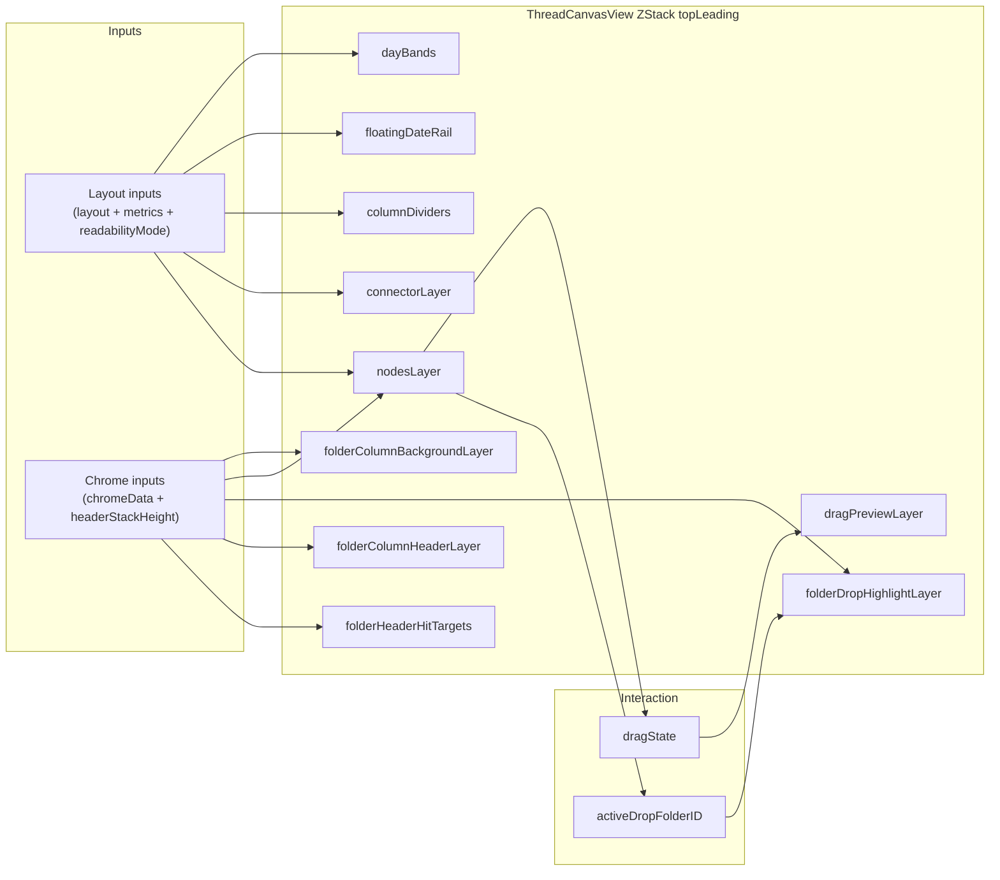

# ThreadCanvasView ZStack Components

Source: `BetterMail/Sources/UI/ThreadCanvasView.swift`

## Overview
`ThreadCanvasView` builds a scrollable canvas and draws its content inside a `ZStack(alignment: .topLeading)`.
The order of views in the ZStack defines the visual stacking (earlier = further back, later = on top).
Timeline layout work is cached in the view model and visible-range updates are throttled to avoid per-scroll recomputation.
During scrolling, the canvas renders only visible days, columns, and nodes (plus a small buffer) to reduce view work. Columns belonging to pinned folders are always rendered.

ZStack draw order (back to front):
1) `dayBands`
2) `folderColumnBackgroundLayer`
3) `floatingDateRail`
4) `columnDividers`
5) `connectorLayer`
6) `nodesLayer`
7) `folderDropHighlightLayer`
8) `dragPreviewLayer`
9) `folderColumnHeaderLayer` (offset upward by header stack height)
10) `folderHeaderHitTargets` (offset upward by header stack height)

## Component Details

### 1) dayBands
- Role: Paints alternating day rows plus optional day labels.
- Key inputs: `layout.days`, `metrics`, `readabilityMode`.
- Notes: This is the primary background grid for time-based alignment.

### 2) folderColumnBackgroundLayer
- Role: Draws the large rounded background for each folder column group (visual column chrome).
- Key inputs: `chromeData`, `metrics`, `headerHeight`.
- Notes: Extends upward to visually connect to folder headers; width expands based on folder depth.

### 3) floatingDateRail
- Role: Draws month/year grouping guides and rotated labels when readability mode is compact/minimal.
- Key inputs: `layout.days`, `metrics`, `readabilityMode`, `calendar`, visible range.
- Notes: Suppressed in detailed mode; items outside the visible range are skipped.

### 4) columnDividers
- Role: Vertical divider lines that separate columns.
- Key inputs: `layout.columns`, `metrics`.
- Notes: Uses a subtle translucent line color; spans full content height.

### 5) connectorLayer
- Role: Renders JWZ and manual connector lanes linking related nodes within each column.
- Key inputs: `layout.columns`, `metrics`, `zoomScale` (for visual emphasis), selection state.
- Notes: Uses `ThreadCanvasConnectorColumn` per column; highlights if any node is selected.

### 6) nodesLayer
- Role: Draws every message node and wires up selection + drag gesture handling.
- Key inputs: `layout.columns`, `metrics`, `chromeData`, `readabilityMode`, `folderHeaderHeight`.
- Notes: Drag gesture updates `dragState` and `activeDropFolderID`; tap selects nodes.

### 7) folderDropHighlightLayer
- Role: Renders the pulsing drop target outline when dragging across folder columns.
- Key inputs: `chromeData`, `metrics`, `headerHeight`, `activeDropFolderID`.
- Notes: Hit-testing disabled so it does not block interactions.

### 8) dragPreviewLayer
- Role: Shows a floating preview of the dragged thread/group.
- Key inputs: `dragState`, `dragPreviewOpacity`, `dragPreviewScale`.
- Notes: Positioned at the cursor location and does not accept hit tests.

### 9) folderColumnHeaderLayer
- Role: Draws the visual folder headers (title, summary, unread count, timestamps).
- Key inputs: `chromeData`, `metrics`, `rawZoom`, `readabilityMode`, selection state.
- Notes: Offset upward to sit above the day bands; hit testing disabled so clicks pass through.

### 10) folderHeaderHitTargets
- Role: Invisible buttons aligned with headers to handle folder selection.
- Key inputs: `chromeData`, `metrics`, `viewModel.selectedFolderID`.
- Notes: Offset upward to align with rendered headers; uses accessibility labels.

## Interaction Relationships
- `nodesLayer` drives drag state updates, which feed `dragPreviewLayer` and `folderDropHighlightLayer`.
- `folderColumnHeaderLayer` is purely visual; `folderHeaderHitTargets` handles interaction.
- `folderColumnBackgroundLayer` and `folderDropHighlightLayer` both expand to include header space so they stay visually connected to headers.

## Scrolling And Folder Jump Reliability

### Why Folder Jumps Must Avoid `scrollTo`
The canvas is a two-axis scroll view (horizontal + vertical). `ScrollViewProxy.scrollTo(_:anchor:)` can change both axes,
which makes folder jump actions drift horizontally (often far left) depending on anchor choice and SwiftUI's internal scroll heuristics.

For folder boundary jumps ("Jump to first email" / "Jump to latest email"), the intended behavior is vertical-only movement:
- Preserve the current horizontal position (column alignment stays the same).
- Scroll only the vertical axis to bring the target node into view.

### How The Vertical-Only Scroll Works
`ThreadCanvasView` resolves the underlying `NSScrollView` and directly adjusts the clip view bounds origin:
- Preserve X: keep `clipView.bounds.origin.x` (or a per-jump preserved X).
- Set Y: compute a desired Y based on boundary type, then clamp to the document's scrollable range.
- Apply: `clipView.setBoundsOrigin(CGPoint(x: preservedX, y: targetY))` + `scrollView.reflectScrolledClipView(clipView)`.

This bypasses SwiftUI's two-axis `scrollTo` behavior and deterministically enforces vertical-only scrolling.

### Why Scroll Host Resolution Placement Matters
The folder jump scroll path requires an `NSScrollView` reference. `ScrollViewResolver` must be attached inside the scrollable
content hierarchy (under the `ScrollView` content / ZStack) so `enclosingScrollView` and superview traversal can find the real host.
If the resolver is attached outside the scrolled content tree, it may never discover the scroll view, causing jump requests to time out.

## Diagram (Mermaid)

