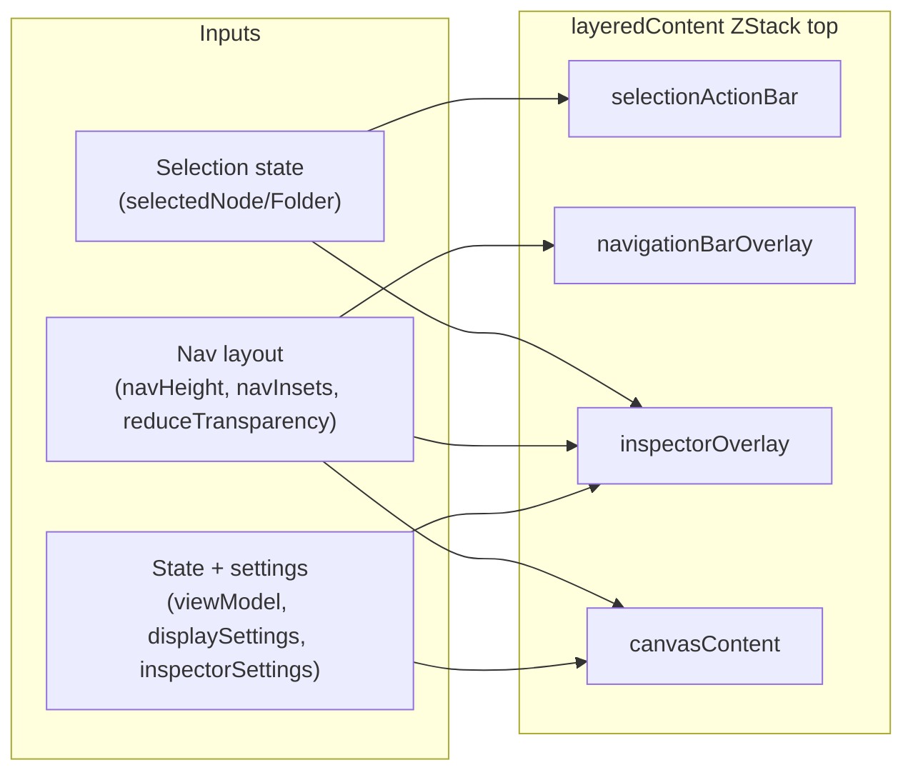

# ThreadListView layeredContent

Source: `BetterMail/Sources/UI/ThreadListView.swift`

## Overview
`ThreadListView` composes its main content in `layeredContent`, a `ZStack(alignment: .top)` that merges the canvas with overlays (inspector, navigation bar, selection actions). The ZStack order controls visibility and interaction priority.

ZStack draw order (back to front):
1) `canvasContent` (optionally wrapped in `GlassEffectContainer` on macOS 26+)
2) `inspectorOverlay`
3) `navigationBarOverlay`
4) `selectionActionBar`

## Component Details

### 1) canvasContent
- Role: Hosts the `ThreadCanvasView` that renders the thread timeline.
- Key inputs: `viewModel`, `displaySettings`, `canvasTopPadding`.
- Notes: Wrapped in `GlassEffectContainer` when available and `reduceTransparency` allows it. Horizontal padding matches nav padding for alignment.

### 2) inspectorOverlay
- Role: Shows folder or thread inspector on the top-right when a selection exists.
- Key inputs: `viewModel.selectedFolder`, `viewModel.selectedNode`, `inspectorSettings`, `selectedSummaryState`.
- Notes: Uses a spring transition and keeps a fixed width; offset down by `navInsetHeight` so it clears the nav bar.

### 3) navigationBarOverlay
- Role: Top navigation bar with status, refresh controls, and limit settings.
- Key inputs: `navHeight` (measured via preference), `isGlassNavEnabled` (based on `reduceTransparency`).
- Notes: Highest zIndex among overlays (1) so it sits above inspector; adjusts canvas padding via `canvasTopPadding`.

### 4) selectionActionBar
- Role: Action bar tied to selection state (e.g., actions for selected nodes).
- Key inputs: selection state from `viewModel` (implementation defined in `selectionActionBar`).
- Notes: Drawn last in the ZStack so it stays above other overlays.

## Interaction Relationships
- `inspectorOverlay` visibility is driven by selection changes in `viewModel`.
- `navigationBarOverlay` height feeds `navHeight`, which influences `canvasTopPadding` and `navInsetHeight`.
- `selectionActionBar` depends on selection state and should stay topmost for interaction.

## Diagram (Mermaid)

